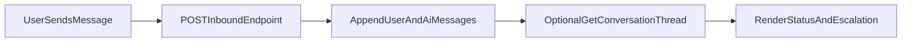

# Frontend Update Guide: Continuous AI Follow-up Replies

## Why this update

The backend now supports continuous AI replies for customer follow-up messages in the same conversation thread.

Previously, the first message (form submit) got an AI response, but later customer replies could be missed depending on the route used.

## New endpoint to use for customer follow-ups

Use this endpoint whenever the **customer** sends another message in an existing thread:

- `POST /api/v1/conversations/{conversation_uuid}/inbound`

### Auth

- If `FORM_SUBMIT_API_KEY` is configured on backend, send:
  - `X-API-Key: <key>`
- If not configured, header is optional.

### Request body

```json
{
  "message": "We primarily work on mixed-use and residential projects. Timeline is 6 months.",
  "channel": "email",
  "metadata": {
    "source": "frontend_chat",
    "conversation_stage": "follow_up"
  }
}
```

- `message` (required)
- `channel` (optional, defaults to conversation channel)
- `metadata` (optional, forwarded as AI pipeline context)

### Response body

```json
{
  "conversation_uuid": "2b71c31f-fd93-46fa-ac60-efb716856c92",
  "inbound_message_uuid": "be9262d7-751d-4fde-93c5-cc3369c19cbf",
  "ai_reply_message_uuid": "bda0675a-e841-4ba6-af10-1c12660c07ee",
  "ai_reply": "Thank you for sharing...",
  "conversation_status": "open",
  "is_escalated": false
}
```

## Existing endpoints and how to use them now

### Keep using (no change)

- `POST /api/v1/forms/{form_id}/submit`
  - First inbound message from public lead form.
- `GET /api/v1/conversations/{conversation_ref}`
  - Load full thread.
- `GET /api/v1/conversations`
  - Inbox list.

### Staff dashboard messages (no change)

- `POST /api/v1/conversations/{conversation_uuid}/messages`
  - For internal human/agent/staff messages.
  - Not the primary route for public customer follow-up auto-replies.

## Frontend behavior changes required

1. **Route selection**
   - Customer follow-up message -> call `/conversations/{uuid}/inbound`
   - Staff reply -> call `/conversations/{uuid}/messages`

2. **Thread update**
   - After successful `inbound` call, either:
     - append two messages in UI (customer + AI reply), or
     - refetch conversation with `GET /conversations/{uuid}`.

3. **Escalation handling**
   - If `is_escalated=true` or `conversation_status="pending_human"`:
     - show human-assistance banner/state in UI.a

4. **Error handling**
   - `400`: invalid UUID
   - `401`: invalid/missing API key
   - `422`: missing required `message`
   - Render user-friendly retry prompts.

## Recommended UI flow (chat widget)



## Minimal integration checklist

- [ ] Add frontend API client for `POST /conversations/{uuid}/inbound`
- [ ] Ensure `X-API-Key` included for public inbound route when required
- [ ] Switch customer follow-up submit action to `inbound` route
- [ ] Keep staff message action on `/messages`
- [ ] Render `conversation_status` and `is_escalated`
- [ ] Add retry handling for `400/401/422`

## Quick curl example (for FE dev verification)

```bash
curl -X POST "http://127.0.0.1:8000/api/v1/conversations/<conversation_uuid>/inbound" \
  -H "Content-Type: application/json" \
  -H "X-API-Key: <form_submit_api_key_if_required>" \
  -d '{
    "message": "Budget range is 250k to 500k. Decision makers are two partners in Karachi.",
    "channel": "email",
    "metadata": {"source":"frontend_chat"}
  }'
```

